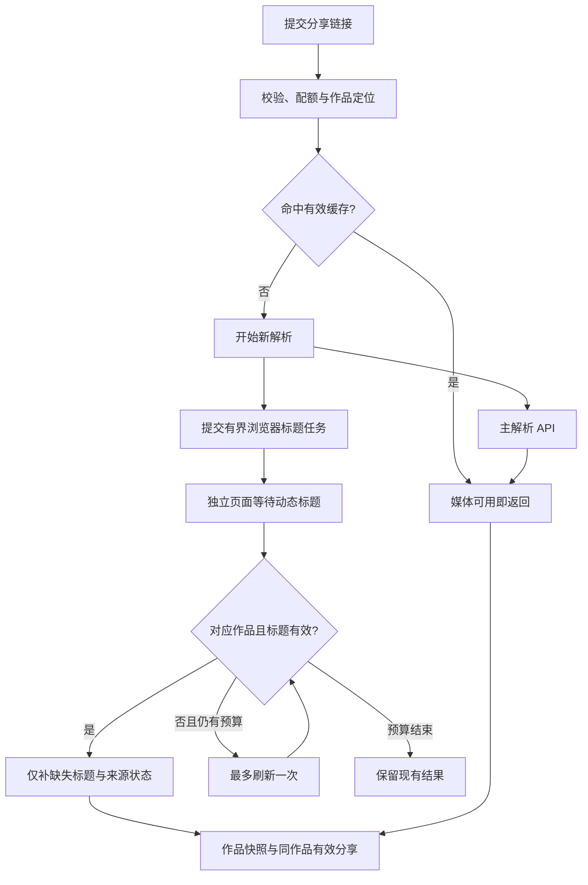

# 浏览器标题并行补全方案

适用版本：v1.33.0；日期：2026-09-27。本方案对应仓库根目录完整版，不适用于独立的 `oss/` 或 `douyin_dl.py`。

## 目标与用户体验

用户提交链接并通过本地校验后，先检查已有结果；缓存命中直接返回，不新开浏览器。需要新解析时，同时启动两个工作：主解析 API 获取视频/图集与作品数据，独立 Chromium 打开原作品页面等待动态标题。媒体结果完成即可返回，浏览器任务不成为主解析的前置条件；标题稍后取得时，再补入作品快照和同作品有效分享；首页与已打开的分享页通过有界轮询更新标题和下载文件名。管理员编辑的分享标题始终优先。

这里的“等完整标题出现”是有时限的质量判定：优先读取对应作品的结构化描述，其次读取绑定相同作品 ID 的详情 DOM 标题；过滤平台首页、登录、验证与加载占位文案。普通 `<title>` 和开放图谱 meta 无法可靠区分推荐内容，本次不作为补全来源。明确的完整字段可提前返回；非省略标题连续稳定 500 毫秒后可作为 available 提前返回，等待期间若出现更完整版本则采用更完整内容。如果初次渲染没有结果或仍为省略内容，可在剩余预算内刷新一次。平台没有返回完整文字时，服务端不能保证恢复原文，不无限刷新，也不等待视频播放或语音转录。

首期浏览器支持抖音作品和分享短链。其他平台继续沿用现有解析接口与标题提示，新增平台需另行补齐域名规则、作品身份识别、标题提取和回归用例。

## 执行与数据流



1. 服务启动时异步预热浏览器。主进程只维护任务、截止时间、去重与回调；Playwright 运行在独立子进程，避免其阻塞或崩溃拖住主服务。
2. 同一作品的重复任务合并；浏览器结果可在主解析完成前合入返回值，或在主解析完成后写回快照。标题抓取不新增解析服务请求，不重复预占或结算配额。
3. 浏览器进程池长期复用（每个并发槽一个 Chromium），每个任务创建独立 context/page；完成后关闭任务页面，释放内存和站点存储。任务不使用个人浏览器资料、账号 Cookie 或共享的持久 profile。
4. 标题只写入来源身份一致的作品；不会借标题任务更新媒体地址、作者、统计数、价格、分享有效期或下架状态。已有有效接口标题与管理员自定义标题保留，分享文案提示可在取得真实页面标题后升级。
5. 分享 GET 只读取本地保存结果，不以访客打开、轮询或刷新为理由重新调用主解析 API。首页仅在标题 pending 时收到有效期 10 分钟、绑定作品与类型的签名 `metadata_url`；`GET /api/parse-metadata/{item_id}` 只返回标题、来源/状态和下载文件名，不返回原平台地址或媒体签名，也不启动浏览器、不计费。第三方客户端缓存的卡片仍由其自身刷新策略决定。

## 时间与资源预算

| 项目 | 默认值 | 处理方式 |
| --- | --- | --- |
| 浏览器标题开关 | 开 | 未安装可选依赖或 Chromium 时快速降级，基础解析继续工作 |
| 标题任务总预算 | 6 秒 | 自入队开始计时，排队、导航、动态内容等待和刷新共享预算 |
| 浏览器并发 | 2 | 硬上限 2；主解析 API 使用自己的并发限制 |
| 等待队列 | 8 | 队满直接跳过补标题，不能阻塞主解析 |
| 浏览器预热 | 最多 12 秒 | 后台启动；用户解析不等待预热完成 |
| 页面刷新 | 最多 1 次 | 仅在没有标题或仍为省略内容、且仍有预算时使用 |
| 媒体等待标题 | 0 秒 | 不为浏览器标题延迟成功媒体响应 |

6 秒是浏览器任务预算，不是整条解析接口的响应时限。原主解析 API 自身等待、媒体处理与必要的 HTTP 兜底仍沿用各自超时。默认值可通过 `BROWSER_TITLE_*` 调整，但增加标题超时不会让主解析等待它。

浏览器不可用、队满、页面超时、重定向被拒绝或没有可用标题均属于可降级结果。浏览器任务未接受时沿用现有 HTTP 补全；严格代理模式下不启动浏览器，避免绕过既有出口策略。禁止无限重试；工作进程失去响应时应在管理器截止时间后清理，不能累积无界任务或遗留浏览器子进程。

## 页面提取与隔离边界

- 导航限定为支持的抖音作品路径或短链，拒绝外站跳转、账号页和非 HTTPS URL。
- 页面资源限制到平台官方域名及明确的 CDN 后缀；解析出的 IP 必须为公网地址。图片、媒体、字体、WebSocket、下载与 service worker 不参与取标题。
- 优先结构化作品字段，并校验作品 ID；DOM 标题仅在有效作品页上读取。清理空白和占位内容，省略文案标注为 partial，不冒充完整标题。
- 不突破登录墙或验证，不把个人 Cookie、持久登录信息、原始网页、网络响应和完整异常写进公开日志。
- 进程隔离和每任务 context 用于故障及会话隔离，不等于操作系统沙箱。现有 Docker 默认运行用户与宿主网络策略需要由部署者管理；生产抓取可按 [Playwright 的 Docker 建议](https://playwright.dev/python/docs/docker) 使用独立用户、适合 Chromium 的 seccomp 配置和受限出口。

## 依赖与部署

浏览器能力是可选项：基础 `requirements.txt` 不增加 Playwright，旧的纯 HTTP 部署仍能运行。可选文件 `requirements-browser.txt` 锁定 Playwright 1.60.0、pyee 13.0.1 与 greenlet 3.2.4，并复用基础依赖约束。Playwright 1.60.0 支持 Python 3.9；1.61.0 开始要求 Python 3.10，因此本次不直接升级到最新版或改变应用 Python 基线。[Playwright 1.60.0 包信息](https://pypi.org/project/playwright/1.60.0/)、[1.61.0 包信息](https://pypi.org/project/playwright/1.61.0/)

```bash
# 在项目根目录、服务实际使用的虚拟环境中安装
.venv/bin/python -m pip install -r requirements-browser.txt
# macOS
.venv/bin/python -m playwright install --only-shell chromium
# Debian / Ubuntu 首次安装（包含系统库，需相应权限）
.venv/bin/python -m playwright install --with-deps --only-shell chromium
```

Playwright 的 Python 包不包含浏览器二进制；浏览器版本与包版本绑定，更新包后需再次安装。仅安装 Chromium headless shell 足够本功能使用，可减少无关浏览器下载。[官方浏览器安装说明](https://playwright.dev/python/docs/browsers#install-browsers)、[headless shell 说明](https://playwright.dev/python/docs/browsers#chromium-headless-shell)

Linux 上安装与运行必须使用一致的 `PLAYWRIGHT_BROWSERS_PATH` 或相同服务用户。默认缓存位于用户目录，因此 root 安装后由 `douyin` 用户启动，可能无法找到浏览器。建议在安装命令与服务环境文件中都指定 `/srv/douyin-dl/browser-cache`，并给服务用户读取权限；系统依赖安装和浏览器缓存权限分别处理。[官方缓存路径说明](https://playwright.dev/python/docs/browsers#managing-browser-binaries)

```bash
# Docker 显式启用浏览器构建；默认 WITH_BROWSER_TITLE=0
docker build --build-arg WITH_BROWSER_TITLE=1 -t douyin-dl:1.33.0 .
```

浏览器构建会把匹配的浏览器安装到 `/opt/playwright`，复制管理器与工作进程脚本。沿用实际数据卷、密码、端口与签名密钥，运行时建议添加 `--init` 回收子进程，并为 Chromium 提供足够共享内存，例如 `--shm-size=256m`；具体内存额度应通过目标服务器负载测试确定。[官方 Docker 进程与共享内存说明](https://playwright.dev/python/docs/docker#recommended-docker-configuration)

`deploy/app.env.example` 提供完整变量模板。设置 `BROWSER_TITLE_ENABLED=0` 可关闭能力；缺依赖时自动降级不代表安装成功，应查看后台功能检查中的浏览器状态。`run.sh` 不会自动加载 `.env` 或自动下载浏览器。上线仍需保持单 Uvicorn worker。

## 验证与未覆盖的外部条件

离线回归应验证：主解析与标题任务同时启动、媒体不等待标题、晚到标题写回、同作品身份限制、管理员标题保护、排队超时、队满跳过、浏览器不可用降级、最多一次刷新、占位/截断过滤、拒绝内网和不允许的页面请求、任务退出清理。独立浏览器烟测应执行真实 JavaScript 延迟标题，用来确认依赖安装与等待逻辑。

真实平台最终成功率仍取决于部署出口、匿名网页权限和当时平台页面结构；离线夹具或浏览器启动成功不代表生产链路已通过。验收应分别记录主解析耗时、媒体就绪时刻、浏览器标题来源/状态、晚到回填时刻和失败分类，而不是只记录整条接口耗时。


### 本次可复现的浏览器烟测证据

在独立临时 Python 3.9.6 环境安装锁定依赖和 Chromium 148.0.7778.96 headless shell，没有修改运行中的服务、真实数据目录或用户虚拟环境。真实浏览器执行本地拦截的官方作品 URL 夹具，结果如下；这些夹具验证执行逻辑，不代表平台可用率。

| 场景 | 结果 | 观察耗时 |
| --- | --- | --- |
| JavaScript 延迟写入同作品 `full_desc` | `browser_structured / complete`，一次导航 | 0.329 秒 |
| JavaScript 延迟写入带作品 ID 的 DOM 标题 | `browser_dom / available`，一次导航，稳定 500 毫秒后提前返回 | 0.879 秒 |
| 初始省略文字，刷新后出现 `full_desc` | `complete`，恰好两次导航 | 2.212 秒 |
| 真正启动管理器子进程并关闭 | `ready` 从 1 回到 0，`pending=0` | 通过 |

耗时来自当前 macOS 测试环境，不能作为生产承诺。当前环境没有 Docker，尚未执行 Linux 镜像构建与容器运行验收。

真实抖音样本在当前机器未能读取：系统 DNS 将官方域名解析为 `198.18.0.0/15` 内的保留地址（疑似本地代理 fake-IP），网络策略在主文档请求阶段拒绝。最终实现会快速结束该任务，并在浏览器诊断返回 `blocked_private_dns`；复测约 0.183 秒完成、浏览器进程仍正常就绪。没有为通过本机测试放开内网规则。生产验收需要可将平台域名解析为正常公网地址的 DNS/网络环境。

最终执行 `bash tools/test.sh`：393 项 Python 测试、110 项 Node 测试全部通过，`git diff --check` 通过。另用独立临时数据库及本地模拟媒体/标题回调启动应用，在实际浏览器确认首页先显示媒体结果，5 秒后自动显示标题和复制文案按钮；分享页标题及文档标题同样自动更新。该页面测试不验证真实视频播放或第三方解析接口，测试服务检查后已关闭。
